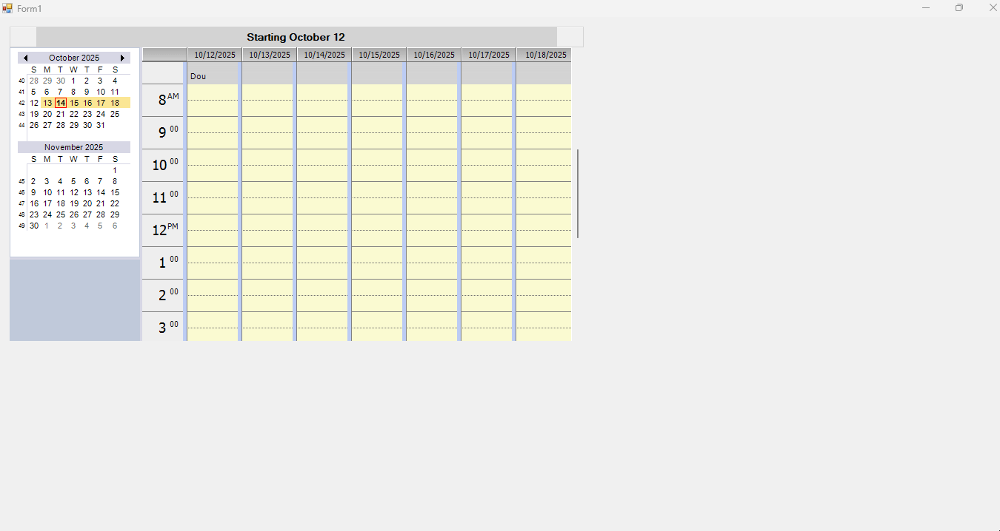

# How to display a full Week View in WinForms ScheduleControl?

In [WinForms ScheduleControl](https://www.syncfusion.com/winforms-ui-controls/scheduler), displaying the full week view including weekend is supported by using the [CustomWeek](https://help.syncfusion.com/cr/windowsforms/Syncfusion.Windows.Forms.Schedule.ScheduleViewType.html) value for the ScheduleType property and specifying the selected dates to include all seven days of the week along with the start day .

```csharp
this.scheduleControl1.ScheduleType = ScheduleViewType.CustomWeek;

this.scheduleControl1.Calendar.SelectedDates.BeginUpdate();
this.scheduleControl1.Calendar.SelectedDates.Clear();
for (int i = 0; i < 7; i++)
{
   // Add 7 days and start day.
   this.scheduleControl1.Calendar.SelectedDates.Add(DateTime.Now.StartOfWeek(DayOfWeek.Sunday).AddDays(i));
}
this.scheduleControl1.Calendar.SelectedDates.EndUpdate();
```

```csharp
public static class Extensions
{
    public static DateTime StartOfWeek(this DateTime dt, DayOfWeek startOfWeek)
    {
        int diff = (7 + (dt.DayOfWeek - startOfWeek)) % 7;
        return dt.AddDays(-1 * diff).Date;
    }
}
```



Take a moment to peruse the [WinForms ScheduleControl - Changing Views](https://help.syncfusion.com/windowsforms/scheduler/getting-started#changing-views) documentation, where you can find about schedule view types.

